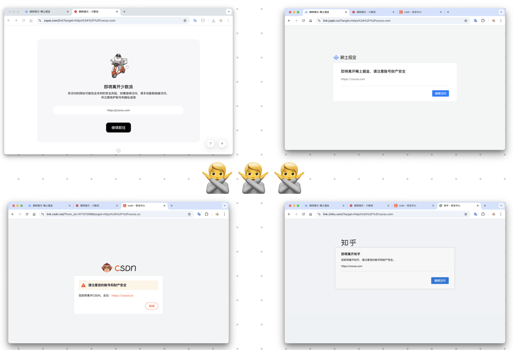

# Redirect-Skipper

    <a href="https://chromewebstore.google.com/detail/redirect-skipper/bcjldhihfjnhgmkmdeojigknladnbcek?authuser=0&hl=zh-CN" target="_blank">
     Chrome 商店安装
  </a>
  <a href="https://chromewebstore.google.com/detail/redirect-skipper/bcjldhihfjnhgmkmdeojigknladnbcek?authuser=0&hl=zh-CN" target="_blank">
     Edge 商店安装
  </a>

  
一款让你无感跳过各种提示外链中转页的浏览器插件。

    A Chrome extension that bypasses redirect warning pages.

### 🚀 功能亮点

无感跳过 [掘金](https://juejin.cn/)、 [知乎](https://www.zhihu.com/)、 [少数派](https://sspai.com/)、 [CSDN](https://www.csdn.net/) 等站点的外链提示页，让你的网页浏览体验更加顺畅。

✨ **核心功能**：

- ⚡ **极速跳转** 使用 onBeforeNavigate 无感拦截，极速跳转
- 📦 **即装即用** 支持知乎、简书、掘金、CSDN、少数派、Gitee 等 50+ 网站的自动跳转！
- ✏️ **自定义规则** 支持用户添加未适配网站，及时生效，无缝同步
- 🪶 **极致轻量** 无任何框架依赖，纯原生开发（包括开发时和运行时）
- 🎨 **明暗主题** 适配了浏览器的明暗主题，视觉体验更协调

### 🛠️ 自定义规则指南

轻松绕过安全跳转，只需简单几步！👇

1️⃣ 当某个站点出现安全跳转时，**点击扩展图标**，将会弹出操作窗口

2️⃣ 在弹窗中输入 **当前页面地址**（通常会自动填充，无需手动输入）。

3️⃣ 在弹窗中输入 **目标地址的参数名称**，可观察地址栏（通常会自动填充，若未填充，可手动填写，常见名称如 `target` 或 `url`）。

4️⃣ 点击 **“添加到创建列表”** 按钮即可保存到用户数据，刷新页面即可生效。

你也可以将你添加的地址反馈给开发者，以便更新插件数据库，普惠其他用户。

[视频教程](https://www.bilibili.com/video/BV1UwjXzSEwL/?vd_source=4d6295fb1c4aeb4020b1de1bc46de5ec)
