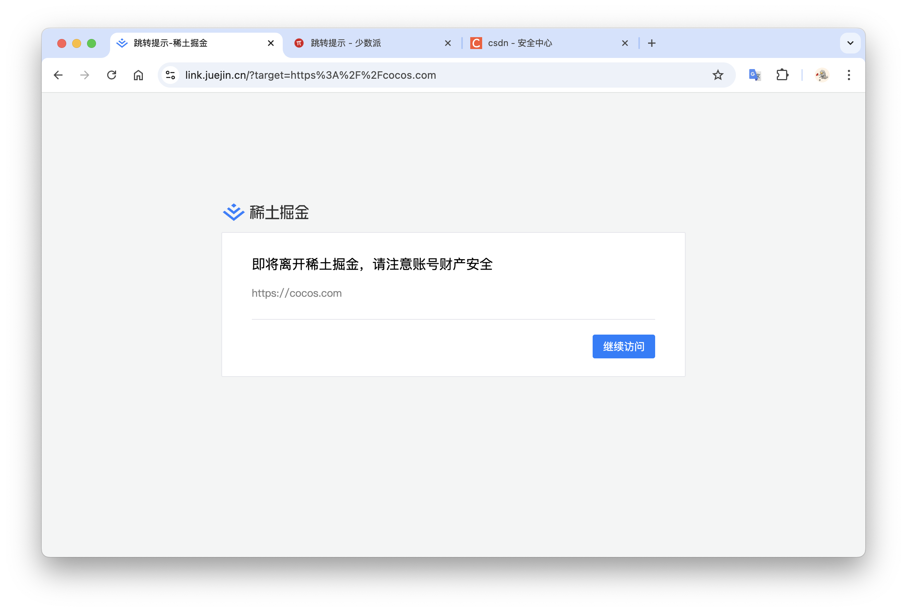
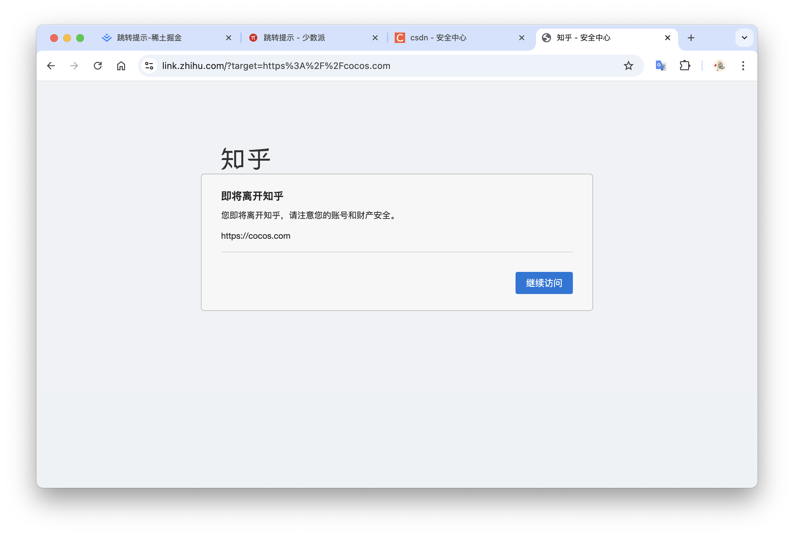
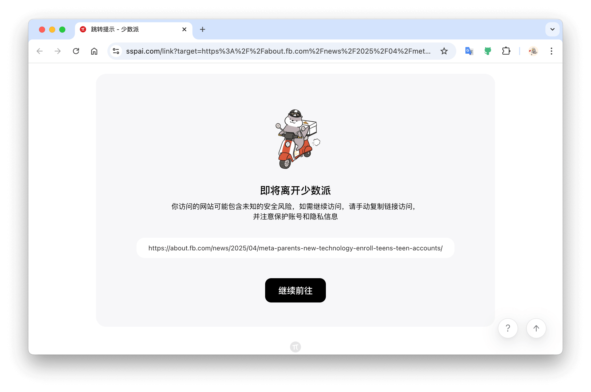

# Redirect-skipper

A Chrome extension that bypasses redirect warning pages.

[插件安装地址](https://chromewebstore.google.com/detail/redirect-skipper/bcjldhihfjnhgmkmdeojigknladnbcek?authuser=0&hl=zh-CN)

启用这个插件之后，将会跳过重定向提示的页面，让网页浏览更顺畅。

## 贡献

如果你希望其他未被收录的网站也可以启用这个插件，那么请更新 `root/sites.json` 这个文件。

前提是你添加的网站的外链的格式是：

`https:xx.com?target=xxxx` 也就是外链地址是通过 `?target=` 来携带的。

如果你希望添加的网站的外链格式比较特殊，那么请更新 `root/scripts/redirect-skipper.js` 里添加具体的连接替换逻辑。
