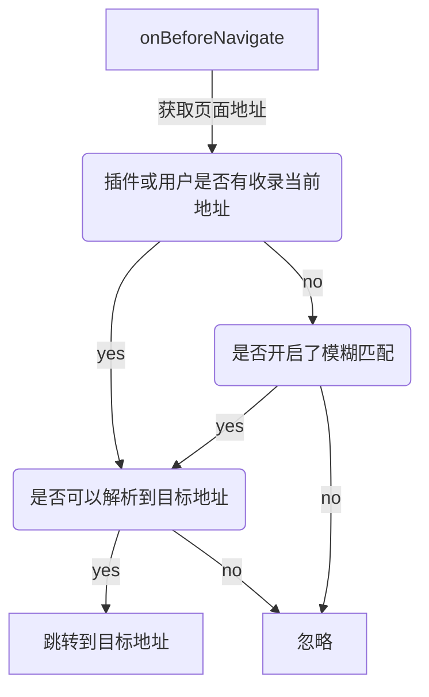

# Redirect-Skipper

    <a href="https://chromewebstore.google.com/detail/redirect-skipper/bcjldhihfjnhgmkmdeojigknladnbcek?authuser=0&hl=zh-CN" target="_blank">
     Chrome 商店安装
  </a>
  <a href="https://github.com/dogodo-cc/redirect-skipper/releases/tag/2.0.0" target="_blank">
     Edge 商店安装
  </a>

  
一款让你无感跳过各种提示外链中转页的浏览器插件。

    A Chrome extension that bypasses redirect warning pages.

### 🚀 功能亮点

无感跳过 [掘金](https://juejin.cn/)、 [知乎](https://www.zhihu.com/)、 [少数派](https://sspai.com/)、 [CSDN](https://www.csdn.net/) 等站点的外链提示页，让你的网页浏览体验更加顺畅。

✨ **核心功能**：

- ⚡️ **极速跳转** 使用 onBeforeNavigate 无感拦截，极速跳转
- 📦 **开箱即用** 支持知乎、简书、掘金、CSDN、少数派、Gitee 等流行网站的自动跳转！
- ✏️ **添加规则** 支持用户添加未适配网站，及时生效，无缝同步 （甚至可以开启模糊匹配）
- 🪶 **极致轻量** 无任何框架依赖，纯原生开发（包括开发阶段和运行时）
- 🎨 **明暗主题** 适配了浏览器的明暗主题，视觉体验更协调

### 🛠️ 自定义规则指南

轻松跳过安全跳转页面，只需简单几步！👇

1️⃣ 当某个站点出现安全跳转页面时，**点击扩展图标**，将会弹出操作面板

2️⃣ 在面板中输入 **当前页面地址**（如果没有自动填充可以手动复制填写）

3️⃣ 在面板中输入 **目标地址的参数名称** （常见的如 target、 href 等都会自动填充）

4️⃣ 点击 **添加到跳过列表** 按钮即可保存到用户数据，刷新页面即可生效。（你也可以将被添加的地址反馈给开发者，以便更新插件内置数据库）

### 流程图

### 产品历程

- 2.x https://juejin.cn/post/7509300461191659560
- 1.x https://juejin.cn/post/7495977411273490447

[视频教程](https://www.bilibili.com/video/BV1UwjXzSEwL/?vd_source=4d6295fb1c4aeb4020b1de1bc46de5ec)
